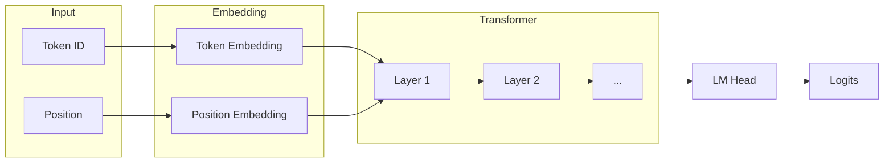
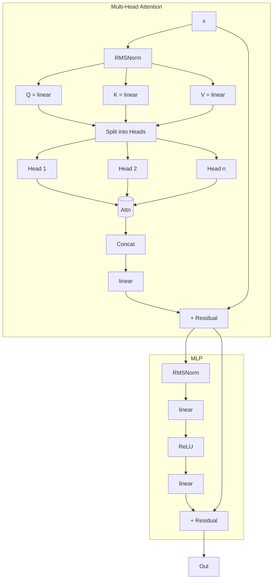
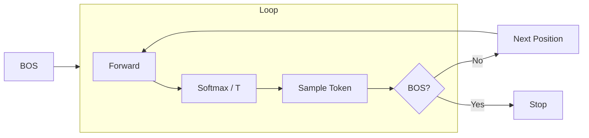
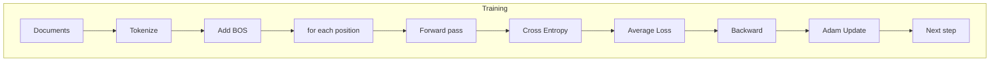

# gpt0.py — GPT 模型

简化版 GPT-2 实现，纯 Python + 自定义自动微分引擎（nn0.py）。

## 模型結構



### 權重參數

| 參數 | 形狀 | 說明 |
|------|------|------|
| `wte` | (vocab_size, n_embd) | Token Embedding |
| `wpe` | (block_size, n_embd) | Position Embedding |
| `lm_head` | (vocab_size, n_embd) | Language Model Head |
| `attn_wq/k/v` | (n_embd, n_embd) | Attention 權重 |
| `attn_wo` | (n_embd, n_embd) | Attention 輸出 |
| `mlp_fc1` | (4*n_embd, n_embd) | MLP 第一層 |
| `mlp_fc2` | (n_embd, 4*n_embd) | MLP 第二層 |

初始化：標準差 0.08 的高斯分布。

## Transformer 層

每層包含：
1. **Multi-Head Attention**
2. **MLP Feed-Forward**



## 與 GPT-2 的差異

| 特性 | GPT-2 | gpt0.py |
|------|------|---------|
| Normalization | LayerNorm | RMSNorm |
| Activation | GeLU | ReLU |
| Bias | 有 | 無 |
| 實現 | PyTorch | 純 Python |

## 訓練（train）

```python
for step in range(num_steps):
    doc = docs[step % len(docs)]
    tokens = [BOS] + char_ids + [BOS]
    loss = gd(model, optimizer, tokens, step, num_steps)
```

流程：
1. 對文檔做 tokenization
2. 加入 BOS（Begin Of String）標記
3. 調用 `gd()` 執行梯度下降

## 生成（inference）

```python
token_id = BOS
for pos_id in range(block_size):
    logits = model(token_id, pos_id, keys, values)
    probs = softmax(logits / temperature)
    token_id = sample(probs)
    if token_id == BOS: break
```



- **Temperature**：控制機率分布的平滑度
  - 低 temperature（< 1）：更確定性輸出
  - 高 temperature（> 1）：更多樣性輸出
- **Sampling**：依據機率加權隨機選取下一個 token

## 運算流程圖



```
train:
  tokens: [BOS] t0 t1 t2 [BOS]
           ↓
  positions:  0  1  2  3  4
           ↓
  for each (token, target):
    logits = model(token, pos)
    loss = -log(probs[target])
           ↓
  avg_loss.backward()
  optimizer.step()
```